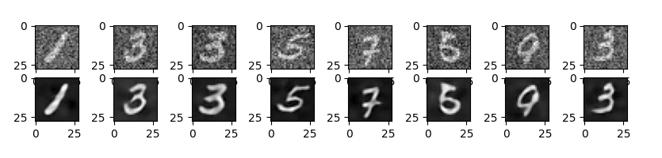

## Denoising Autoencoder

### Introduction

Autoencoder are type of nerual network which are trained to replicate the orignal data. It is a unsupervised learning technique. It is used for removing noise, dimensionality reduction, feature extraction, and learning generative models of data. They work by compressing the input into a latent-space representation, and then reconstructing the output from this representation. This kind of network is composed of two parts: an encoder and a decoder. The encoder compresses the input and produces the latent-space representation, and the decoder then reconstructs the original input only using this representation.

### Training results

The model was trained for 10 epochs on MNIST dataset. The loss function decreased with each epoch. The loss function for the last epoch was 0.9753. After 10 epochs model generated the following output on test data.



### How to run

1. Clone the repository

2. Install the requirements

```bash
pip install -r requirements.txt
```

3. Start the Flask server

```bash
  cd app
  python main.py
```

4. Open the browser and go to http://0.0.0.0:8000
   (If Hello World message appers then the server is running)

5. Now you can move your noisy image to the test folder and run the script to get the denoised image.

```python
files = {'image': open('image_name.png', 'rb')}
```

Make sure to put your actual image name instead of `image_name.png`

Now run the below script to get the denoised image.

```bash
  cd test
  python test.py
```
